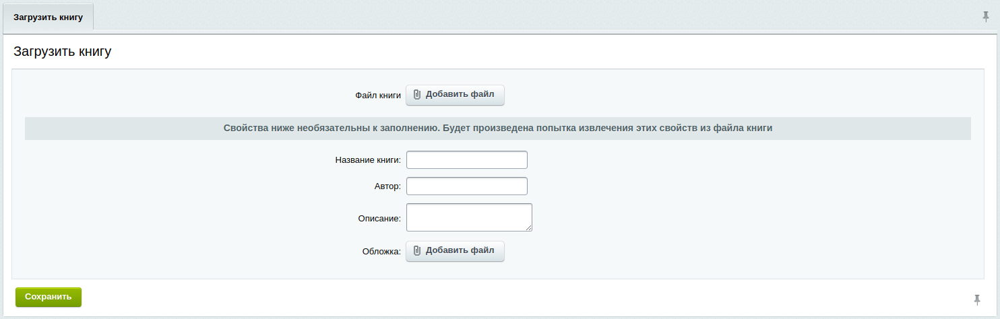
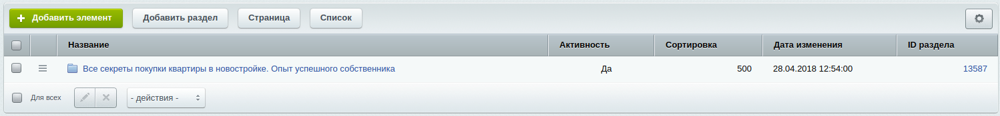
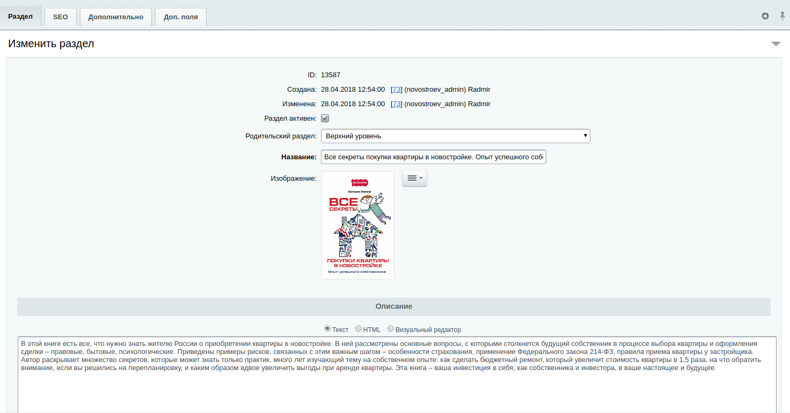
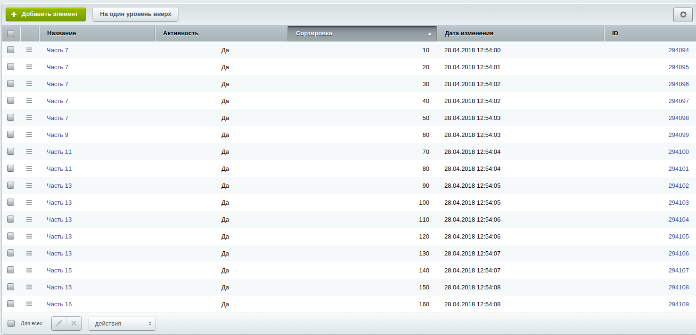

# epub-parser
Модуль для битрикса, который позволяет загружать контент epub книг в инфоблоки

# Использование

После установки модуля будет создан информационный блок для книг и добавлен административный раздел

В настройках модуля задайте нужное вам количество символов на одной странице. Точное количество варьируется от заданного значения на +-100 символов (в связи с тем, что обрезается последний абзац в файле и закрываются незакрытые теги)

В административном разделе загрузите файл книги с расширением .epub.

Свойства будут прочитаны из файла книги, но можете их переписать, задав свои значения.

После успешной загрузки книги добавится раздел в созданном инфоблоке. 

 

Каджлый раздел - одна книга. Поле автора находится в дополнительном свойстве в разделе

Каждый элемент раздела - одна страница, которая содержит заданное в настройках модуля количество символов +-100.

Все картинки книги загружаются в папку upload, в служебную уникальную дирректорию. Все пути до картинок в книге меняются на эту дирректорию, поэтому все картинки в книжке сохраняются.
Также сохраняется весь html, который был в книге. Для вывода книг подойдут базовые битриксовские компоненты, но на моем проекте я написал свои. Не включил их в модуль, поскольку они зависимы от библиотек, которые используются в проекте.